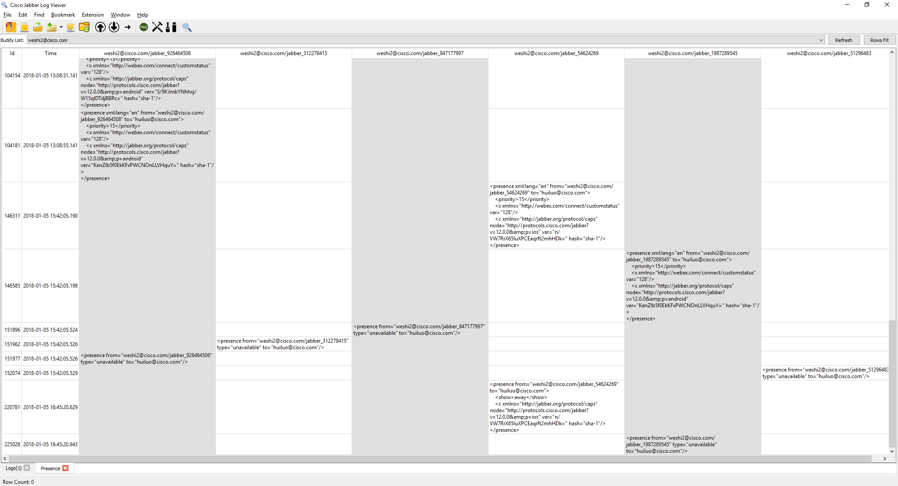
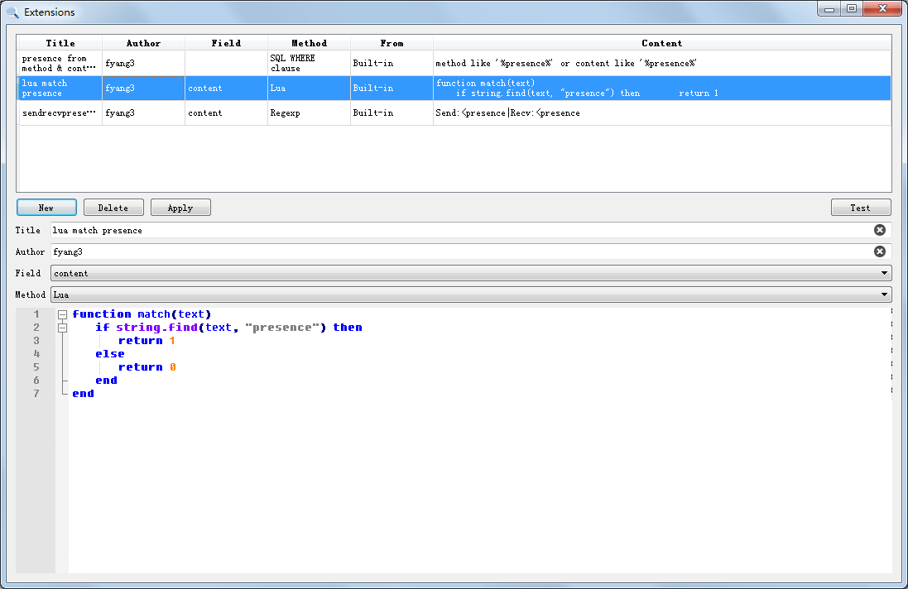

Cisco Jabber Log Viewer
----

| Platform | Status                                                                                                                                  |
| -------- | --------------------------------------------------------------------------------------------------------------------------------------- |
| Windows  |  |
| macOS    |                            |

As mentioned by name, this is an easy to use tool for reading logs generated by [Cisco Jabber](https://www.cisco.com/c/en/us/products/unified-communications/jabber/index.html).

# Features

- Support reading raw log files(such as  jabber.log, jabber.log.1, jabber.log.2, jabber.log.3, jabber.log.4,  jabber.log.5), folders contains raw log files, zip package of PRT
- Presence view, shows someone's presences separated by resources
- Stanza only search scope options
- Drag & Drop to open logs
- Open PRT via PRT Tracking System URL, eg. <http://prt.jabberqa.cisco.com/#/conversations/58f5dbc106202b308d000004>
- Open PRT via Jabber Win PRT website([http://jabber-prt.cisco.com/ProblemReportTriageTool/#](http://jabber-prt.cisco.com/ProblemReportTriageTool/)), eg. 65766
- Open specified rows in new tab
- Quick keyword/regexp filter
- Indented format XML of stanza preview
- source file/code line preview
- raw log file view
- Extension architecture to support complex filters, such as SQL WHERE clause, [Lua ](http://www.lua.org/manual/5.3/)extends match() function etc.
- Windows/macOS supported

# Search Syntax

- search as SQL '%keyword%' by default
- could search as Regexp mode by checking **Regexp Mode** menu item, it's expected to be compatible with PCRE syntax
- search  in one column per operation, the column name is displayed in search  edit box, and it could be changed by select menu item in **Find - Search Field**
- shortcut select Search Field by putting prefix in keyword, for example: **m>enforce** to search keyword 'enforce' in column method, abbreviation prefix list is shown in table:

  | Field       | Single Char Abbreviation | Long Form Abbrevation                   |
  | ----------- | ------------------------ | --------------------------------------- |
  | ID          | i                        | id                                      |
  | Date Time   | d                        | datetime (2 or more leading characters) |
  | Level       | v                        | level (2 or more leading characters)    |
  | Thread      | t                        | thread (2 or more leading characters)   |
  | Source File | s                        | source (2 or more leading characters)   |
  | Category    | a                        | category (2 or more leading characters) |
  | Method      | m                        | method (2 or more leading characters)   |
  | Content     | c                        | content (2 or more leading characters)  |
  | Log File    | f                        | logfile (2 or more leading characters)  |
  | Line        | l                        | line (2 or more leading characters)     |

- Notice: shortcut will overwrite menu item settings.
- shortcut enable/disable regexp mode search: **r>keyword**, **!r>keyword**
- shortcut Search Field and Regexp mode can be used together, for example: **m:r>keyword**

# Screenshots

# Build From Source

## Dependency

* Python
* Boost
* Qt 5.12 or higher

## Build Steps

* Clone repository: `git clone --recursive https://github.com/missdeer/cjlv.git`
* Set Boost path to environemnt if your Boost is not in common search path: `set BOOST_ROOT=$HOME/Boost`
* Generate Scintilla Qt wrapper source files: `cd 3rdparty/scintilla/qt/ScintillaEdit && python WidgetGen.py`
* Open `cjlv.pro` by Qt Creator, then build it.